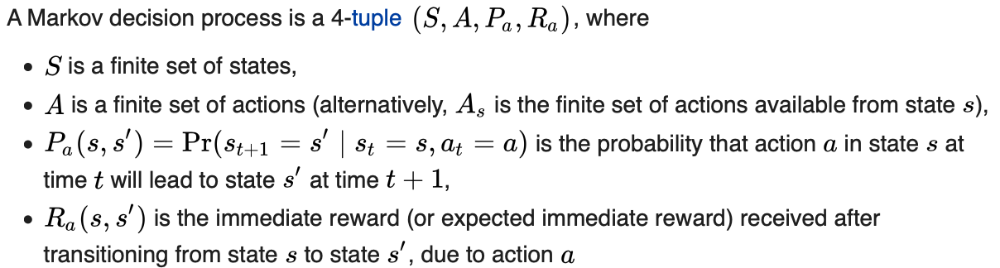
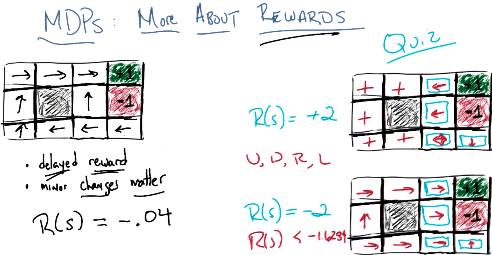
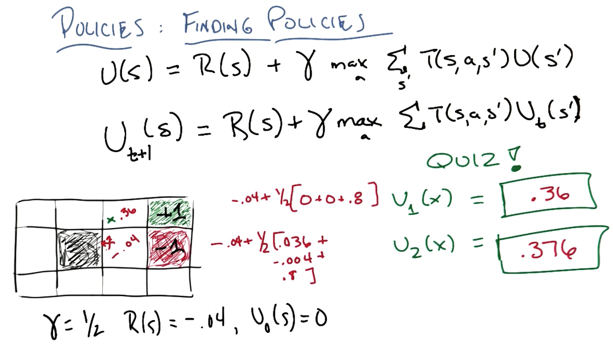
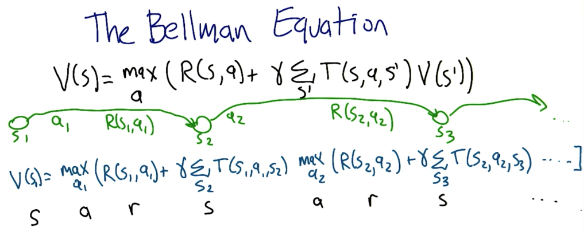
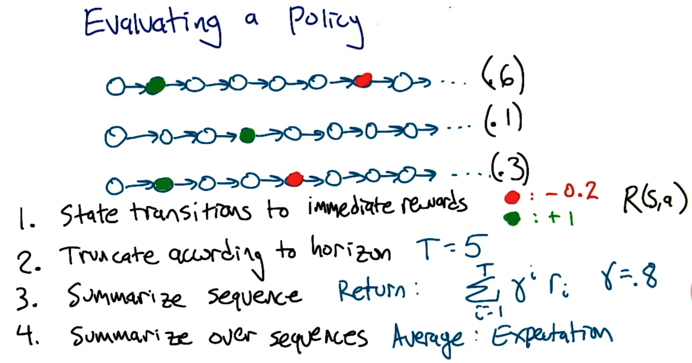
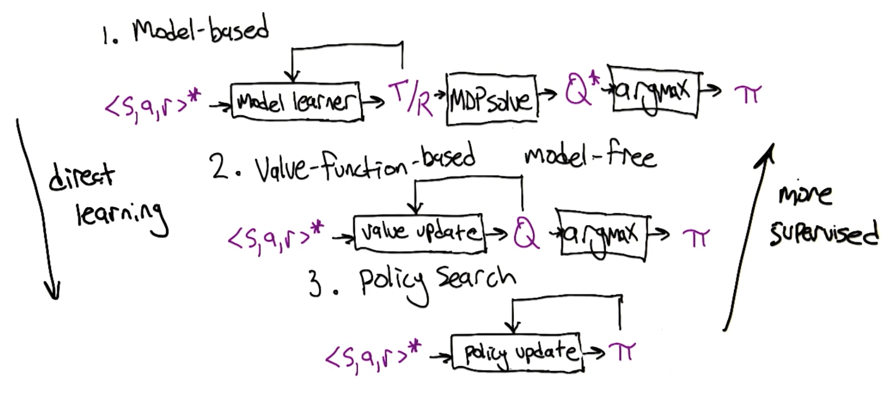
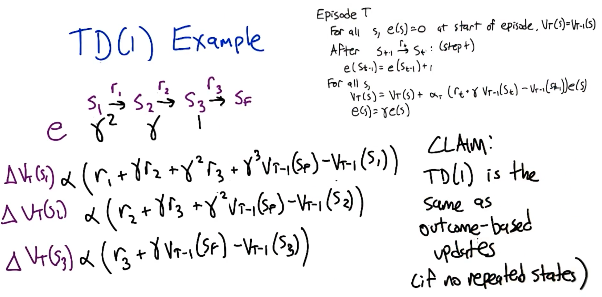
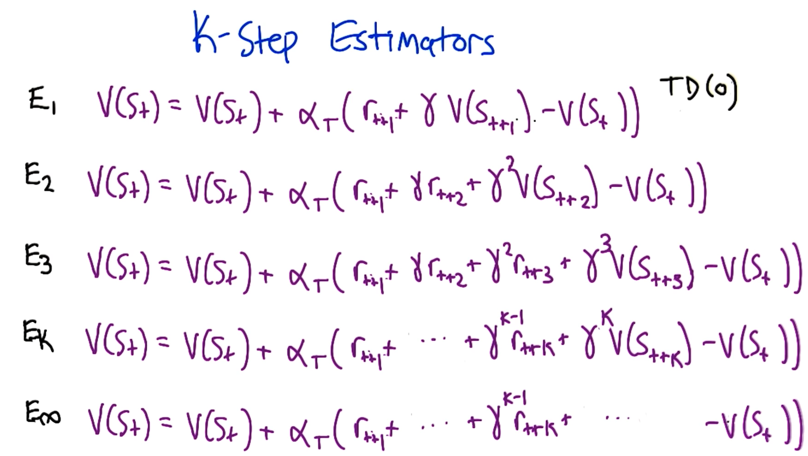

# Reinforcement Learning

## Decision Making and Reinforcement Learning

- Supervised Learning: $y = f(x)$
  - function approximation: given $x$, $y$ pairs, find function $f$ that maps $x$ to $y$
- Unsupervised Learning: $f(x)$
  - find $f$ that is a compact description of data x
- Reinforcement Learning: $y = f(x), z$
  - Given a string of pairs of data
  - Given $x$ and $z$'s, learn $f$ that generates $y$

## Markov Decision Processes

[Wikipedia](https://en.wikipedia.org/wiki/Markov_decision_process) Definition:

### The problem

- State: $S$
- Actions: $A(s), A$
- Model
  - Rules of the game you are playing. Transition model $T$ describes how to transition from state $s^\prime$ to state $s$ given actions $a$.
  - "The physics of the world"
  - Stationary: rules don't change, so the transition models don't change
  - $T(s,a,s^\prime) ~ Pr(s^\prime|s,a)$
- Reward: $R(s), R(s,a), R(s,a,s^\prime)$
  - A scalar value for being in the state
  - $R(s)$: reward for being in a state
  - $R(s, a)$: reward for being in a state and taking an action
  - $R(s, a, s^\prime)$ reward for being in a state, taking an action, and end up in another state

Markov property:

- only the present matters
- transitions only depends the current state $s$
- A stochastic process has the Markov property if the conditional probability distribution of future states of the process (conditional on both past and present states) depends only upon the present state, not on the sequence of events that preceded it. A process with this property is called a Markov process.

### The solution

- Policy:
  - For any given state, it gives the action you should take
  - $\pi(s) \rightarrow a$
  - $\pi^*$ is the optimal policy which maximizes long term expected reward

### More about rewards

- Delayed reward
- Minor changes in the reward function matter

[Temporal credit assignment](https://ai.stackexchange.com/questions/12908/what-is-the-credit-assignment-problem):

> In reinforcement learning (RL), an agent interacts with an environment in time steps. On each time step, the agent takes an action in a certain state and the environment emits a percept or perception, which is composed of a reward and an observation, which, in the case of fully-observable MDPs, is the next state (of the environment and the agent). The goal of the agent is to maximize the reward in the long run.
>
> The (temporal) credit assignment problem (CAP) (discussed in Steps Toward Artificial Intelligence by Marvin Minsky in 1961) is the problem of determining the actions that lead to a certain outcome.
>
> For example, in football, at each second, each football player takes an action. In this context, an action can e.g. be "pass the ball", "dribble", "run" or "shoot the ball". At the end of the football match, the outcome can either be a victory, a loss or a tie. After the match, the coach talks to the players and analyses the match and the performance of each player. He discusses the contribution of each player to the result of the match. The problem of determining the contribution of each player to the result of the match is the (temporal) credit assignment problem.
>
> How is this related to RL? In order to maximize the reward in the long run, the agent needs to determine which actions will lead to such outcome, which is essentially the temporal CAP.
>
> Why is it called credit assignment problem? In this context, the word credit is a synonym for value. In RL, an action that leads to a higher final cumulative reward should have more value (so more "credit" should be assigned to it) than an action that leads to a lower final reward.
>
> Why is the CAP relevant to RL? Most RL agents attempt to solve the CAP. For example, a Q-learning agent attempts to learn an (optimal) value function. To do so, it needs to determine the actions that will lead to the highest value in each state.
>
> There are a few variations of the (temporal) CAP problem. For example, the structural CAP, that is, the problem of assigning credit to each structural component (which might contribute to the final outcome) of the system.

Reward functions can affect the MDP

## Sequence of Rewards

Previous assumptions:

- Infinite horizons: game doesn't end until reaching an absorbent state
- Utility of sequences:

  $$
  $$

  $$U(S_0,S1,S2 ...) = \sum_{t = 0}^\infin \gamma^t R(S_t) \leq \sum_{t = 0}^\infin \gamma^t R_{\text{max}} = \frac{R_{\text{max}}}{1 - \gamma} \text{ where } 0 \leq \gamma < 1$$

## Policies

$$\pi^* = \arg \max_\pi E[\sum_{t = 0}^\infin \gamma^t R(S_t) | \pi]$$
$$U^\pi(s) =E[\sum_{t = 0}^\infin \gamma^t R(S_t) | \pi, S_0 = S] $$

Note: $R(S)$ is an immediate reward, while $U^\pi(S)$ is the long term expected benefit. $U^pi(S)$ accounts for all delayed awards.

$$\pi^*(S) = \arg \max_a \sum_{S^\prime} T(S,a,S^\prime) U(S^\prime)$$

### Finding Policies

$$\text{Bellman Equation: }U(S) = R(S) + \gamma \max_a \sum_{S^\prime} T(S,a,S^\prime) U(S^\prime)$$

- $n$ equations
- $n$ unknowns
- $\max$ introduces non-linearity

Solving the system of equations:

#### Value iteration

- start with arbitrary utilities
- update utilities based on neighbors
- repeat until convergence
  i.e. \\\\\$\\\\$\hat{U}\\\\_{t+ 1}(S) = R(S) + \gamma \max_a \sum\\\\_{S^\prime} T(S,a,S^\prime) \hat{U}\\\\_t(S^\prime)\\\text{ where } \hat{U}\\\\_t(S) \text{ is the estimate of the utility of \\\\$S\\\\$ at time \\\\$t\\\\$.}\\\\$\$
- Intuition: $R(S)$ is a truth, and in every iteration truth is added to estimates. As more truth is added, you move closer to the true utility of states.
  

#### Policy Iteration

- start with $\pi_0$, a random guess
- evaluate: given $\pi_t$, calculate $U_t = U^{\pi_t}$
- improve: $\pi_{t+1} = \arg\max_a \sum T(S,a,S^\prime)U_t(S^\prime)$
- Now a linear equation: $\hat{U}_{t+ 1}(S) = R(S) + \gamma \sum_{S^\prime} T(S,\pi_t(s),S^\prime) \hat{U}_t(S^\prime)$

## The Bellman Equation

And this is "Value" version of the Bellman equation is equivalent to the "Quality" version of the equation
$$ Q(S,a) = R(S,a) + \gamma\sum_{S^\prime} T(S,a,S^\prime)\max_{a^\prime}Q(S^\prime, a^\prime)$$
or the "Continuation" version of the equation
$$C(S,a) = \gamma \sum_{S^\prime} T(S,a,S^\prime)\max_{a^\prime}(R(S^\prime, a^\prime) + C(S^\prime, a^\prime)).$$

## Reinforcement Learning Basics

Agents interacting environments and getting rewards, and finding out what the world is about.

### Behavior Structures

- plan: fixed sequence of actions
  - during learning
  - stochasticity
- conditional plan: includes "if" statements
- stationary policy/universal plan: mapping from state to action
  - if at every state: same
  - very large
  - always optimal stationary policy for every MDP

### Evaluating a policy

### Evaluating a learner

- value of returned policy
- computational complexity (time)
- sample complexity (time): how much data it needs

## Temporal Difference Learning

### RL Context

$<s, a, r>^* \rightarrow$ RL algorithm $\rightarrow \pi$

#### Model-based

$<s, a, r>^* \rightarrow \xleftrightarrow[\text{model learner} \rightarrow \text{Transitions/Rewards}]{} \rightarrow$ MDP Solver $\rightarrow Q^* \rightarrow \argmax \rightarrow \pi$

Model learner can take current estimate of transitions/rewards and update estimates.

#### Value-function-based (model free)

$<s, a, r>^* \rightarrow \xleftrightarrow[\text{value update} \rightarrow Q^*]{} \rightarrow \argmax \rightarrow \pi$

Learn $Q*$ directly from $<s, a, r>^*$

#### Policy Search

$<s, a, r>^* \rightarrow \xleftrightarrow[\text{policy update} \rightarrow \pi]{}$

### $TD(\lambda)$

Learning to predict over time

### Computing Estimates Incrementally

$$
\begin{aligned}
V_T(S_1) &= \frac{(T-1)V_{T-1}(S_1) + R_T(S_1)}{T} \\
         &= \frac{T-1}{T}V_{T-1}(S_1) + \frac{1}{T}R_T(S_1) \\
         &= V_{T-1}(S_1) + \alpha_T\underbrace{(R_T(S_1) - V_{T-1}(S_1))}_\text{error}
\end{aligned}
$$

### Properties of Learning Rates

$$V_T(S_1) = \alpha_T(R_T(S_1) - V_{T-1}(S_1))$$
$$\lim_{T\rightarrow\infty}V_T(S) = V(S) \text{ if } \sum_T \alpha_T = \infty \text { and } \sum_T \alpha_T^2 < \infty$$

### $TD(1)$ Rule

$$s_1 \xrightarrow{r_1} s_2 \xrightarrow{r_2} s_3 \xrightarrow{r_3} s_F $$

- Episode T

  - For all states $s$, initialize eligibility $e(s) = 0$ at start of episode, $V_T(s) = V_{T-1}(s)$
  - After $s_{t-1} \xrightarrow{r_t} s_t$: update $e(s_{t-1}) = e(s_{t-1}) + 1$
  - For all $s$
    - $V_T(s) = V_T(s) + \alpha_T(r_t + \gamma V_{T-1}(S_t) - V_{T-1}(S_{t-1}))e(s)$
    - $e(s) = \gamma e(s)$

### $TD(0)$ Rule

Finds Maximum Likelihood estimate

$$
\begin{aligned}
V_T(S_{t-1}) &= V_T(s_{t-1}) + \alpha_T(r_t + \gamma V_T(s_t) - V_T(s_{t-1})) \\
V_T(S_{t-1}) &= E\left[r_t + \gamma V_T(s_t)\right]\\
V_T(S_{t-1}) &= E\left[r_t + \gamma r_{t+1} + \gamma ^2 r_{t+2} + ... \right]
\end{aligned}
$$

### $TD(\lambda)$ Rule

Both $TD(0)$ and $TD(1)$ have updates based on differences between temporally successive predictions. One algorithm covers both!

$TD(1)$

- Episode T
  - For all states $s$, initialize eligibility $e(s) = 0$ at start of episode, $V_T(s) = V_{T-1}(s)$
  - After $s_{t-1} \xrightarrow{r_t} s_t$: update $e(s_{t-1}) = e(s_{t-1}) + 1$
  - For all $s$
    - $V_T(s) = V_T(s) + \alpha_T(r_t + \gamma V_{T-1}(S_t) - V_{T-1}(S_{t-1}))e(s)$
    - $e(s) = \gamma e(s)$

\$- Episode T

- For all states $s$, $V_T(s) = V_{T-1}(s)$
- After $s_{t-1} \xrightarrow{r_t} s_t$
- For all $s$
  - $V_T(s) = V_T(s) + \alpha_T(r_t + \gamma V_{T-1}(S_t) - V_{T-1}(S_{t-1}))$

$TD(\lambda)$

- Episode T
  - For all states $s$, initialize eligibility $e(s) = 0$ at start of episode, $V_T(s) = V_{T-1}(s)$
  - After $s_{t-1} \xrightarrow{r_t} s_t$: update $e(s_{t-1}) = e(s_{t-1}) + 1$
  - For all $s$
    - $V_T(s) = V_T(s) + \alpha_T(r_t + \gamma V_{T-1}(S_t) - V_{T-1}(S_{t-1}))e(s)$
    - $e(s) = \lambda \gamma e(s)$

### K-Step Estimators

## Convergence: TD with Control

### Bellman Equations

#### No Actions

$$V(s) = R(s) + \gamma \sum_{s^{\prime}}T(s,s^{\prime})V(s^{\prime})$$

update rule (actually TD(0))

- if : $<s_{t-1}, r_t, s_t>$ (start state => get some reward => end state):
  $$V_t(s_{t-1}) = V_{t-1}(s_{t-1}) + \alpha_t(r_t + \gamma V_{t-1}(s_t) - V_t(s_{t-1}))$$
- otherwise:
  $$V_t(s) = V_{t-1}(s)$$

#### With Actions

$$Q(s,a) = R(s,a) + \gamma \sum_{s^\prime}T(s,a,s^\prime) \max_{a^\prime}Q(s^\prime, a^\prime)$$

update rule (actually TD(0))

- if : $<s_{t-1}, a_{t-1}, r_t, s_t>$ (start state => action => get some reward => end state):
  $$Q_t(s_{t-1}, a_{t-1}) = Q_{t-1}(s_{t-1}, a_{t-1}) + \alpha_t(r_t + \gamma \max_{a^\prime}Q_{t-1}(s_t, a^\prime) - Q_{t-1}(s_{t-1}, a_{t-1}))$$
- otherwise:
  $$Q_t(s, a) = Q_{t-1}(s, a)$$

Approximations:

1. if we knew the model, synchronously update
   $$Q_t(s,a) = R(s,a) + \gamma \sum_{s^\prime}T(s,a,s^\prime) \max_{a^\prime}Q_{t-1}(s^\prime, a^\prime)$$
2. If we knew $Q^*$, sampling asynchronously update ($Q^*$ stands for Q-value for each state-action pair that would be obtained by following the optimal policy after taking action a in state s.)
   $$Q_t(s_{t-1}, a_{t-1}) = Q_{t-1}(s_{t-1}, a_{t-1}) + \alpha_t(r_t + \gamma \max_{a^\prime}Q^*(s_t, a^\prime) - Q_{t-1}(s_{t-1}, a_{t-1}))$$

### Bellman operator

Let $B$ be an operator, or mapping from value functions to value functions.

$$[BQ](s,a) = R(s,a) + \gamma\sum_{s^\prime}T(s,a,s^\prime) \max_{a^\prime}Q(s^\prime, a^\prime)$$

### Contraction Mappings

$B$ is an operator. If, for all $F$, $G$ and some $0 \leq \gamma < 1$,
$$||BF - BG||_\infty \leq gamma ||F - G||_\infty,$$
then $B$ is a contraction mapping.

Note: $||Q||_\infty = max_{s,a}|Q(s,a)|$

#### Contraction properties

If $B$ is a contraction mapping:

1. $F^* = BF^*$ has a solution and it is unique: this can be proved by contradiction
2. $F_t = BF_{t-1} \Rightarrow F_t \rightarrow F^*$ (value iteration converges)
   $$||F_{t} - F^*||_\infty = ||BF_{t-1} - BF^*||_\infty \leq gamma ||F_{t-1} - F^*||_\infty,$$
  
### Bellman operator contracts

$$[BQ](s,a) = R(s,a) + \gamma\sum_{s^\prime}T(s,a,s^\prime) \max_{a^\prime}Q(s^\prime, a^\prime)$$

Given $Q_1$, $Q_2$,

$$
\begin{aligned}
||BQ_{1} - BQ_2||_\infty &= \max_{a,s}|[BQ_1](s,a) - [BQ_2](s,a)| \\
& = \max_{a,s}|\gamma\sum_{s^\prime}T(s,a,s^\prime)(\max_{a^\prime}Q_1(s^\prime, a^\prime) - \max_{a^\prime}Q_2(s^\prime, a^\prime))| \\
& \leq \gamma \max_{s^\prime}|\max_{a^\prime}Q_1(s^\prime, a^\prime) - \max_{a^\prime}Q_2(s^\prime, a^\prime)| \quad\text{ ($T(s,a,s^\prime)$ sums to one.)} \\
& \leq \gamma \max_{s^\prime, a^\prime}|Q_1(s^\prime, a^\prime) - Q_2(s^\prime, a^\prime)| \\
& = \gamma ||Q_1 - Q_2||_\infty
\end{aligned}
$$

#### Note: max is non-expansion

For all $f,g$, $$|\max_a f(a) - \max_a g(a)| \leq \max_a|f(a) - g(a)|$$

Proof: WLOG $\max_a f(a)\geq \max_a g(a)$,

$$
\begin{aligned}
|\max_a f(a) - \max_a g(a)| &= \max_a f(a) - \max(a) g(a)\\
&= f(a_1) - g(a_2) \quad \text{where $a_1 = \argmax f(a)$ and $a_2 = \argmax g(a)$}\\
&\leq f(a_1) - g(a_1)\\
&= |f(a_1) - g(a_1)| \\
&\leq \max_a |f(a) - g(a)|
\end{aligned}
$$

### Convergence

Define $\alpha_t(s,a) = 0$ if $s_t \neq s, a_t \neq a$.

**Theorem**: Let $B$ be a contraction mapping and $Q^* = BQ^*$ be its fixed point. Let $Q_0$ be a $Q$ function and define $Q_{t+1} = [B_tQ_t]Q_t$. Then, $Q_t \rightarrow Q^*$ if:

1. For all $u1, u2, s, a$: $$|([B_tU_1]Q^*)(s,a) - ([B_tU_2]Q^*)(s,a)| \leq (1 - \alpha_t(s,a))|U_1(s,a) - U_2(s,a)|$$
2. For all $Q,U,s,a$: $$|([B_tU]Q^*)(s,a) - ([B_tU]Q)(s,a)| \leq \gamma\alpha_t(s,a)|Q^*(s,a) - Q(s,a)|$$
3. $\sum_t \alpha_t = \infty$ and $\sum_t \alpha_t^2 < \infty$ 

#### Convergence Theorem Explained

$$
\begin{aligned}
([B_tQ]W)(s,a) &= Q(s,a) + \alpha_t(s,a)(r_t + \gamma \max_{a^\prime}W(s_t, a^\prime) - Q(s,a))
\end{aligned}
$$